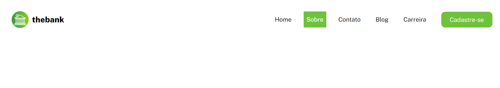
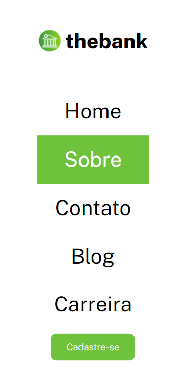

<h1>Responsive menu with flexbox</h1>

 This is a simple and responsive menu built using flexbox as an exercise for advanced HTML and CSS practicing, proposed by the course DevQuest by <a href="https://github.com/devemdobro" target="_blank">Dev em Dobro</a>.

<h2>Overview</h2>
<h3>Screen preview</h3>
<h4>Desktop</h4>

<h4>Mobile</h4>

<h3>Link</h3>
<ul>
    <li>Live site URL: <a href="https://julianastahelin.github.io/menu-with-flexbox/">https://julianastahelin.github.io/menu-with-flexbox/</a></li>
</ul>

<h2>My process</h2>

<h3>Built with 👩🏽‍💻</h3> 
<ul>
    <li>HTML 5;</li>
    <li>CSS 3.</li>
</ul>

<h3>What I learned 💪🏽</h3>
<ul>
    <li>Using CSS Flexbox;</li>
    <li>Using media queries for responsiveness.</li>
</ul>
